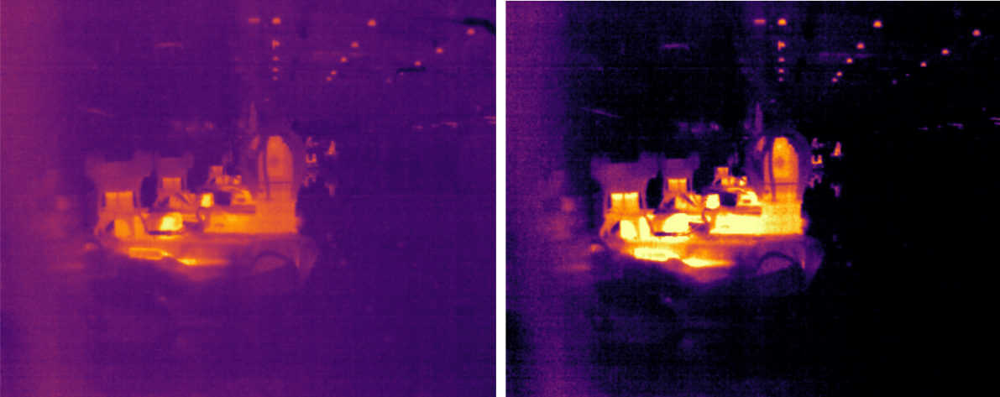
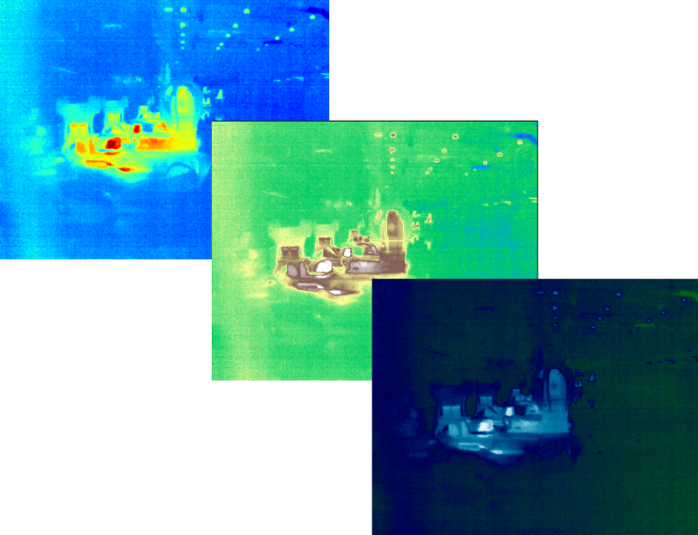

<!--
Copyright (c) 2023 Boston Dynamics, Inc.  All rights reserved.

Downloading, reproducing, distributing or otherwise using the SDK Software
is subject to the terms and conditions of the Boston Dynamics Software
Development Kit License (20191101-BDSDK-SL).
-->

# Thermal Raw Data

The Spot CAM+IR payload allows capture of thermal data in the forms of `.raw` or `.pgm` files. Raw data files allow for more versatility when compared to a thermal `jpeg` image because they allow the thermal data to be rendered or analyzed as needed. For example, re-construction of a thermal image from the raw thermal data enables viewing with custom color palettes or to perform specific image processing in more advanced applications.

## Understanding thermal data

The raw thermal data from the Spot CAM+IR contains 327,680 (640x512) 16-bit unsigned values. Each value describes a temperature in units of decikelvin. To get the value in units of kelvin, divide the value by 10.

The two bytes encoding each data value are given in **big endian**, meaning that the most significant byte of the two is given first when reading the data from left to right. There is an exception to this for version 3.1.0 of the Spot CAM+IR software, in which the byte order of the data was reversed to **little endian**.

| SpotCAM+IR Software Version | Endianness    |
| --------------------------- | ------------- |
| v3.1.0                      | Little endian |
| All other versions          | Big endian    |

### Thermal file types (`.pgm` vs `.raw`)

Raw data captured using the SDK is captured as `.pgm` while the same data captured using callbacks is captured as `.raw`. Both contain the same data, except that the `.pgm` file contains additional header lines. In general, `.pgm` files are downloaded when using the spot SDK while `.raw` files are downloaded when downloading through [the data service](data_buffer_overview.md#data-acquisition-download). The example script can read both file types, but it throws away any header files. The `.pgm` headers are necessary to parse the data if the width and height of the image are variable.

## Rendering raw thermal data

Some image viewers can natively open .pgm files as a grayscale image. To instead show with a particular color palette, a lookup-table can be referenced to map from temperature to a color. For example, the lookup tables used by matplotlib can be referenced at this [link](https://github.com/matplotlib/matplotlib/blob/850bf04d317cbd85f3baff888dd273582d19a3c7/lib/matplotlib/_cm_listed.py)

### Scaling the color mapping

The left image is a render using the min and max temperatures mapping directly to the min and max values in the color map. The image on the right shows the same image but with the mapping adjusted so that the lower temperature values are less prominent. This allows for more contrast and improved visibility of the hotter areas.


### Color palettes:

The following renderings are generated from a single thermal data capture and rendered with OpenCV.


### Example code

```
import matplotlib.pyplot as plt
import numpy

# width and height based on the Spot CAM+IR thermal camera
height = 512
width = 640
filename = "/path/to/pgm/or/raw/file"
endianness = '>' # '>' For big-endian and '<' for little-endian
with open(filename, 'rb') as f:
    buffer = f.read()

    try:
        # For .pgm and .raw files transferred from the tablet or downloaded from Orbit
        processed_data = numpy.frombuffer(buffer, dtype=f'{endianness}u2')
    except ValueError:
        # For .pgm and .raw files from the SpotCam+IR itself (using the Media Log service)
        # The last element for both .pgm and .raw files is the data after splitting by newline
        split_buffer = buffer.splitlines()
        processed_data = numpy.frombuffer(split_buffer[len(split_buffer) - 1], dtype=f'{endianness}u2')

    processed_data = processed_data.reshape((int(height), int(width)))

    image = list(processed_data)
    plt.imshow(image, plt.cm.inferno) # some alternate colormaps: inferno, plasma, viridis, ocean, cubehelix, rainbow
    plt.show()
```
