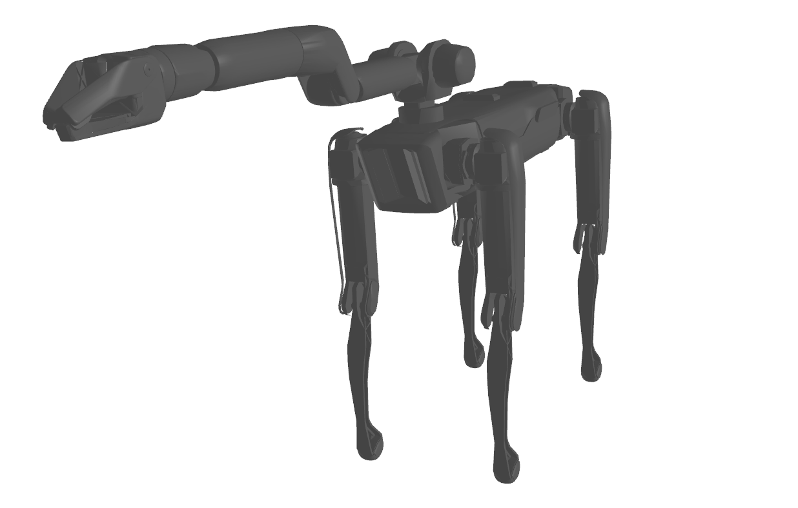

<!--
Copyright (c) 2023 Boston Dynamics, Inc.  All rights reserved.

Downloading, reproducing, distributing or otherwise using the SDK Software
is subject to the terms and conditions of the Boston Dynamics Software
Development Kit License (20191101-BDSDK-SL).
-->

# Supplemental Data

Contains additional simulation data for the development of control algorithms for the Spot robot and simulations.


## Contents

Table for the variable max knee torque due to the knee linkage.

- [Knee Torque Limits](knee_torque_limits.md)

## Joint Order

All repeated fields for commands and state are in a consistent order as outlined in [spot_constants.proto](../../../protos/bosdyn/api/spot/spot_constants.proto).

## Robot Morphology

Robot structure can be found by inspecting the full URDF located [here](../../../files/spot_with_arm_urdf.zip). **Note:** This URDF contains additional information compared to what is available through the [RobotStateService](../../../docs/concepts/robot_services.md#robot-state) and the URDF for an armless robot located [here](../../../files/spot_base_urdf.zip).

## Joint Transmission Details

### Joint Gear Ratios and Max Motor Torque

Most joints are simply actuated with a constant gear ratio.

| Joint | Gear Ratio | Max motor torque |
| ----- | ---------- | ---------------- |
| HX    | 51         | 0.88             |
| HY    | 51         | 0.88             |
| KN    | variable   | 1.50             |
| SH0   | 101        | 0.89             |
| SH1   | coupled    | 0.89             |
| EL0   | coupled    | 0.89             |
| EL1   | 101        | 0.23             |
| WR0   | 101        | 0.23             |
| WR1   | 101        | 0.23             |
| F1X   | 56.55      | 0.20             |

### Knee Joints

The Spot robot knee is actuated using a ball-screw and push-rod mechanism connected to the lower leg. Due to the push-rod's geometry, the maximum torque achievable varies depending on the configuration. The knee exhibits its greatest strength at the midpoint of its range and its weakest when fully flexed or extended. For details on the variable transmission ratio, refer to the file available [here](knee_torque_limits.md). This transmission ratio describes the motor input to knee angle output relationship as:

```
Tr(q_kn) = qd_motor / qd_kn
```

### Coupled SH1/EL0 Joints

The SH1/EL0 joints are driven by a coupled set of input actuators. The 2x2 Jacobian describing the output velocities is:

```
[qd_sh1; qd_el0] = (1/101) * [1 0; -1 1] * [qd_motor0; qd_motor1]
```
