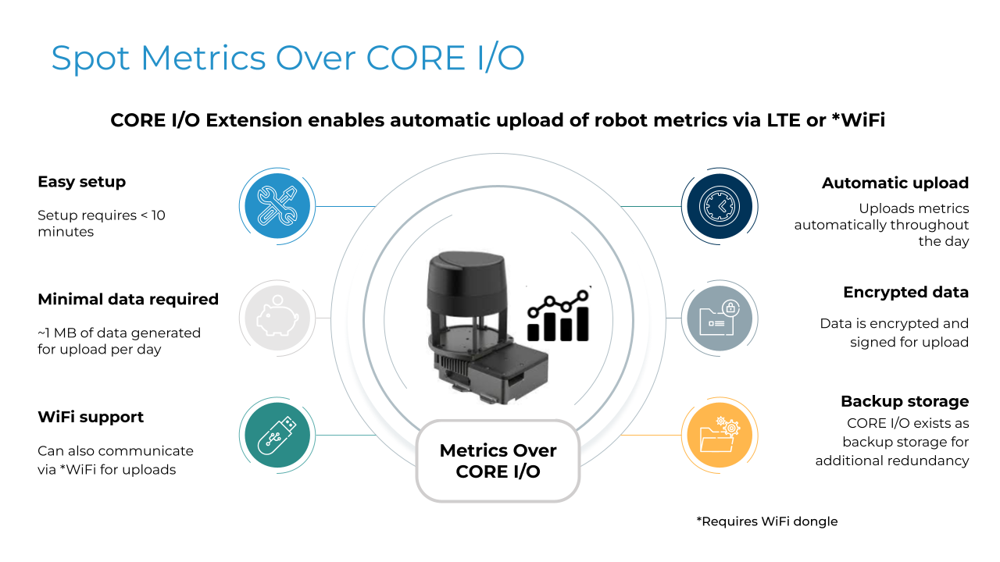

<!--
Copyright (c) 2023 Boston Dynamics, Inc.  All rights reserved.

Downloading, reproducing, distributing or otherwise using the SDK Software
is subject to the terms and conditions of the Boston Dynamics Software
Development Kit License (20191101-BDSDK-SL).
-->

## Overview



## Usage

#### LTE

1. Acquire an LTE sim with a static IP and corresponding apn settings or a wifi dongle
2. Setup LTE on core using the instructions found here: https://support.bostondynamics.com/s/article/Spot-CORE-I-O-User-Guide#FiveGsetup

#### Wifi

1. Currently only wifi networks that can be authorized via the nmcli network interface: https://developer-old.gnome.org/NetworkManager/stable/nmcli.html - are supported. Generally any network that only requires a password falls in this category.
2. Acquire a supported Linux-compatible USB WiFi adapter such as one from Panda Wireless: https://www.pandawireless.com/
3. A. Plug in the wifi dongle
4. B. Use the link here to set default internet route for the core to the wifi dongle - https://support.bostondynamics.com/s/article/How-To-Configure-Spot-WIFI-Network-Settings

### Building the CoreIO Extension

1. Navigate to `metrics_over_coreio` in the public api directory
2. Run

```sh
python3 ../extensions/build_extension.py --dockerfile-paths Dockerfile --build-image-tags metrics_over_coreio:arm64  --image-archive  metrics_over_coreio.tar.gz --icon ./extension/icon.png --package-dir ./extension/  --spx metrics_over_modem.spx
```

- Note: Please see helper messages in build_extension.py to customize file paths as needed.
- Note you will need the appropriate Spot Python packages installed including bosdyn-core>=4.0,bosdyn-client>=4.0 and bosdyn-api>=4.0. This can be found [here](../../../docs/python/quickstart.md#install-spot-python-packages)

3. Load generated .spx file from where downloaded to the core through the intended extension console

## Components

At a high level, `src` contains the fundamental code to pull metrics from the robot and upload them to the bosdyn server. The root folder contains the Dockerfile and base script to generate the extension, and `extension` contains supporting files to be included directly in the spx, such as the docker compose file.

Most of the logic is contained in `src/metric_file_group.py`, `src/uploader.py`, and `src/metrics_over_coreio.py`. In this file, we have the following classes:

1. `MetricFileGroup`: Manages querying and writing metric files to the core I/O file system.
2. `Uploader`: Manages uploading metrics. Sends the latest metric on the core, recieves missing metrics sequence numbers and uploads them.
3. `MetricManager`: Manages switching between savin and loading metrics. Does some basic state checks and manages the threads running.

## Recommended debugging

1. Confirm the COREIO is connected to the internet through the COREIO network page or by using ssh and terminal commands.

If using LTE 2. Confirm your APN and MTU are correctly configured based on your sim card and carrier 3. Confirm your data plan has not reached its limit 4. Check the cellular bands and disable those with poor connection by selectively enabling some and examining the network signals in the COREIO page

If using Wifi 2. Confirm no 2FA or other form of autentication was required 3. Confirm wifi dongle is powered, physically connected and has not come loose
